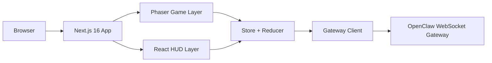

# Architecture

Last Updated: March 10, 2026

## System Overview

Agent Town is a browser-based Next.js application with a Phaser office scene and a React HUD layered over a reducer-driven client store. The store connects to an OpenClaw gateway through a WebSocket client and translates gateway activity into visual worker behavior and task state while keeping OpenClaw as the execution and routing source of truth.

### ASCII Overview

```text
Browser
  |
  v
Next.js App Router
  |
  +--> Phaser Game Layer (office, workers, movement, seat events)
  |
  +--> Pixel-Art HUD Layer (pixel-panel borders, pixel fonts, neon glow)
           |
           v
      Store + Reducer
           |
           v
      Gateway Client
           |
           v
   OpenClaw WebSocket Gateway
```

### Mermaid Overview



## Layer Breakdown

### 1. Game Layer (Phaser 3)

Primary responsibilities:

- Render the office map and workers
- Discover seats from map metadata
- Route worker animations and bubbles
- Translate in-world interactions into app events

Key modules:

- `src/components/game/scenes/OfficeScene.ts`
- `src/components/game/PhaserGame.tsx`
- `src/components/game/entities/Worker.ts`
- `src/components/game/entities/Player.ts`
- `src/components/game/utils/MapHelpers.ts`
- `src/components/game/config/animations.ts`

### 2. Pixel-Art HUD Layer (React)

Primary responsibilities:

- Surface connection status and controls
- Present task history, chat, worker status, settings, and overlays
- Trigger task submission and model selection actions
- Provide analytics dashboard with token usage, task success rate, and gateway health
- **Visual Design**: All panels use `pixel-panel` CSS class — 2px solid neon borders, zero border-radius, pixel fonts (Ark Pixel / Press Start 2P), scanline overlay, and neon glow accents on dark navy backgrounds. The HUD aesthetic is fully consistent with the isometric Phaser game layer.

Key HUD components:

- `PixelHeader.tsx` — NiagaBot Control Center with live status and efficiency
- `AnalyticsDashboard.tsx` — Token usage, task success rate, gateway health, response time
- `PixelTabBar.tsx` — Bottom navigation: Notifications, Logs, Settings
- `CommandTerminal.tsx` — Always-visible quick task submission
- `TaskPipelineTracker.tsx` — Real-time 6-stage task processing visibility (submitted → received → routing → delegated → processing → done)
- `AgentStatusPanel.tsx` — Agent online/offline status with task logs
- `ChatPanel.tsx`, `TaskPanel.tsx`, `ConnectionPanel.tsx`, `ContextMeter.tsx`

The repo currently contains 27+ HUD-oriented panel components under `src/components/hud/`, all styled with the pixel-art design system.

### 3. State Layer (Store + Reducer)

Primary responsibilities:

- Hold session, task, seat, and chat state
- Persist bounded local workspace state
- Bridge game events to gateway actions
- Normalize gateway events into UI state

Key modules:

- `src/lib/store.ts`
- `src/lib/reducer.ts`
- `src/lib/persistence.ts`
- `src/lib/events.ts`

The project carries Zustand 5 as a dependency, but the active state runtime is implemented with React context plus reducer orchestration in `store.ts`.

### 4. Gateway Layer

Primary responsibilities:

- Maintain WebSocket connectivity and handshake state
- Send task and model requests to OpenClaw
- Dispatch streamed gateway events into state transitions

Key modules:

- `src/lib/gateway.ts`
- `src/lib/gateway-handler.ts`
- `src/lib/gateway-types.ts`

### 5. Data Layer

Primary responsibilities:

- Define the visual agent registry
- Map visual agents to OpenClaw workspace identities
- Provide constants, colors, labels, and validated environment config

Key modules:

- `src/lib/agent-data.ts`
- `src/components/game/config/animations.ts`
- `src/lib/constants.ts`
- `src/lib/env.ts`

### 6. API Layer

The app ships with 5 API routes:

- `/api`
- `/api/health`
- `/api/models`
- `/api/session`
- `/api/task`

These routes cover app metadata, health, model listing, and durable app-local task/session persistence. The task/session routes are protected with `OPENPROJECT_API_TOKEN` and supplement operator history rather than replacing OpenClaw's own runtime state.

## Agent Registry Architecture

The agent registry has two linked layers:

1. `src/lib/agent-data.ts`
   Stores the canonical business definition for each of the 24 visual agents, including department, skills, revenue range, and optional `openclawId`.

2. `src/components/game/config/animations.ts`
   Stores the visual worker sprite registry, including sprite sheet path, label, department color, personality text, catchphrases, and optional `openclawId`.

`openclawId` acts as the bridge between the visual roster and deployed OpenClaw workspace agents. That separation matters because:

- the frontend may preserve stable short labels such as `Trend Intel` or `Command Center`
- NiagaBot/main remains the sole operator-facing entry session while still receiving canonical specialist hints such as `trend-intelligence-agent`
- one standalone repo, `brand-research-agent`, can coexist with the 17-agent `social-growth-suite` workspace without collapsing naming in the visual layer

## Identity Model

Each agent has three distinct identifiers:

| Identifier | Purpose | Example | Unique? |
|:--|:--|:--|:--|
| `agentId` | Primary UI/runtime identity | `a1`, `g3`, `c3` | ✅ Yes |
| `spriteKey` | Phaser rendering resource | `character_02` | ❌ Reused |
| `openclawId` | OpenClaw workspace / delegation mapping | `trend-intelligence-agent` | ✅ Yes (when mapped) |

- `agentId` is used for selection, persistence, seat assignment, and all UI state
- `spriteKey` is used only for Phaser sprite rendering and animation creation
- `openclawId` bridges the visual roster to deployed OpenClaw workspace agents without turning the browser into the routing source of truth

Legacy `spriteKey`-based lookups fall back through `normalizeStoredOperativeId()` in `animations.ts`.

## Routing Architecture

Seat-targeted task routing uses a NiagaBot-first delegation pattern:

```text
User assigns task to seat
  -> store resolves seat via resolveSeatRoutingTarget(seats, seatId)
  -> extracts seat.openclawId + visual identity metadata
  -> buildDelegationMessage(...) wraps the request as operator_dispatch context
  -> gateway sends chat.send to the active session or NiagaBot/main fallback
  -> NiagaBot decides whether to delegate to the mapped specialist workspace
```

For unmapped seats (no `openclawId`), the request still enters NiagaBot/main but without a specialist hint.

## Operative → Phaser Binding

Operative selection bridges React state to Phaser runtime:

1. User selects operative in `CharacterSelectPanel` → stored as `agentId`
2. `page.tsx` dispatches `OPERATIVE_CHANGED_EVENT` custom DOM event
3. `OfficeScene.ts` listens for the event and calls `player.changeSprite(newSpriteKey)`
4. `Player.ts` recreates sprite and animations from the new sprite sheet
5. On reload, `getSelectedCharacter()` restores from localStorage via `agentId`

## Connection Lifecycle

The gateway connection uses a runtime-token guard pattern:

- `canAutoConnectGateway(config)` returns `true` only if a saved URL exists and the stored config does not require a fresh runtime token
- On reload, the app can restore the URL and auto-connect for no-token environments
- If the gateway requires operator re-auth, the user must re-enter the token through the ConnectionPanel UI

## External Systems

Agent Town does not host the agent workspaces directly. It depends on external deployments:

- `social-growth-suite`
  Provides 17 OpenClaw workspace agents that are deployed separately to the gateway.
- `brand-research-agent`
  Provides 1 standalone OpenClaw workspace agent deployed separately.
- OpenClaw gateway
  Serves as the real-time WebSocket bridge for agent execution, sessions, model selection, and streamed responses, with NiagaBot/main as the sole user-facing entry session.

## Data Flow

End-to-end message flow:

```text
User message
  -> terminal modal / HUD action
  -> store assigns local task
  -> game events route task to a seat
  -> gateway client sends request to OpenClaw
  -> NiagaBot/main receives operator request + delegation hints
  -> NiagaBot may delegate to a specialist workspace + tools
  -> streamed reply returns through WebSocket
  -> gateway handler dispatches updates
  -> reducer updates tasks/chat/seats
  -> Phaser worker state + React HUD re-render
```

## Directory Structure

```text
OPENPROJECT-1/
├── docs/
│   ├── ARCHITECTURE.md
│   └── PRD.md
├── prisma/
│   └── schema.prisma
├── public/
│   ├── audio/
│   ├── characters/
│   ├── maps/
│   ├── sprites/
│   └── tilesets/
├── src/
│   ├── __tests__/
│   ├── app/
│   │   ├── api/
│   │   │   ├── health/
│   │   │   ├── models/
│   │   │   ├── session/
│   │   │   ├── task/
│   │   │   └── route.ts
│   │   ├── globals.css
│   │   ├── layout.tsx
│   │   └── page.tsx
│   ├── components/
│   │   ├── editor/
│   │   ├── game/
│   │   ├── hud/
│   │   ├── onboarding/
│   │   ├── panel/
│   │   └── ui/
│   ├── hooks/
│   ├── lib/
│   │   ├── agent-data.ts
│   │   ├── constants.ts
│   │   ├── db.ts
│   │   ├── env.ts
│   │   ├── events.ts
│   │   ├── gateway-handler.ts
│   │   ├── gateway-types.ts
│   │   ├── gateway.ts
│   │   ├── persistence.ts
│   │   ├── reducer.ts
│   │   ├── store.ts
│   │   └── utils.ts
│   └── types/
│       └── game.ts
├── package.json
├── README.md
└── vitest.config.ts
```

## Operational Notes

- The browser no longer auto-loads a privileged gateway token from public env; runtime token entry is expected through the UI.
- Seat discovery is map-driven, while worker identity and OpenClaw mapping are registry-driven.
- Build and test validation should cover both registry files because the visual and OpenClaw mappings must remain in lockstep.
- `agentId` is the canonical identity across persistence, UI selection, and seat assignment.
- `openclawId` is the canonical delegation and mapping key for specialist routing hints.
- `Player.ts` accepts a dynamic `spriteKey` at construction and supports runtime sprite swapping.
- TypeScript typecheck passes with zero core errors (only `examples/websocket` external types remain).
