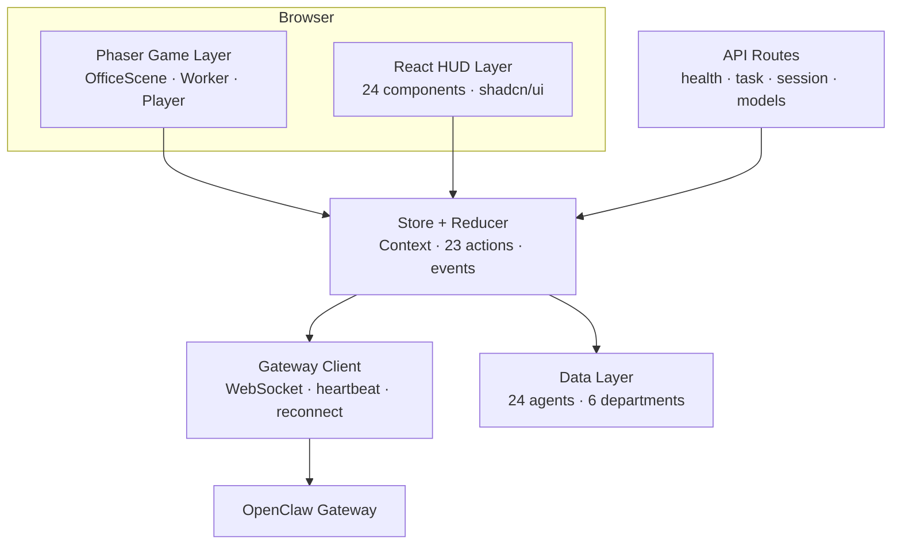

# OPENPROJECT-1 (Agent Town) — Comprehensive Code Review

**Reviewed**: 100% of source files (every `.ts`, `.tsx`, `.css`, `.md`, `.json`, `.prisma`)
**Date**: March 10, 2026
**Revised**: March 10, 2026 (post-Codex reconciliation)

---

## TL;DR

Agent Town is a **well-architected** Next.js 16 + Phaser 3 spatial operator console with clean layer separation, strong TypeScript typing, and a robust gateway integration. All 6 workstreams from the review fix plan are completed. The codebase is **pre-production** — the architecture and features are solid, but build/test gates (`ignoreBuildErrors`, `noImplicitAny`, Prisma drift) must be cleaned and verified before a broader release.

---

## Architecture Score: 8.5/10



### Layer Breakdown

| Layer | Key Files | Lines | Quality |
|:------|:----------|------:|:--------|
| Game Engine | `OfficeScene.ts`, `Worker.ts`, `Player.ts` | ~1,100 | ⭐⭐⭐⭐ Solid Phaser usage |
| HUD | 24 components in `hud/` | ~3,500+ | ⭐⭐⭐⭐ Clean composition |
| State | `store.ts`, `reducer.ts` | ~1,027 | ⭐⭐⭐⭐⭐ Pure reducer, clean actions |
| Gateway | `gateway.ts`, `gateway-handler.ts`, `gateway-types.ts` | ~1,282 | ⭐⭐⭐⭐⭐ Robust WebSocket |
| Data | `agent-data.ts`, `animations.ts` | ~365 | ⭐⭐⭐⭐ Well-structured registry |
| Design System | `globals.css` | 1,003 | ⭐⭐⭐⭐⭐ Premium pixel-art theme |

---

## ✅ Strengths

### 1. Gateway Integration (Best-in-Class)

- `gateway.ts`: Challenge-based handshake, exponential backoff reconnection, heartbeat keepalive, rate limit detection
- `gateway-handler.ts`: Clean event→dispatch separation, throttled speech bubbles, sub-agent tracking
- `gateway-types.ts`: Discriminated unions with type guards — no unsafe casts

### 2. State Architecture

- `reducer.ts`: Pure reducer with 23 action types, immutable updates, session-aware filtering
- `store.ts`: Context provider with clean lifecycle, NiagaBot-first delegation routing via `buildNiagaBotSessionKey()` and `buildDelegationMessage()`, bounded persistence
- `persistence.ts`: Safe localStorage with size caps (200 tasks, 400 chats, 20 sessions)

### 3. Agent Identity Model

- Triple-ID system: `agentId` (unique UI key) → `spriteKey` (shared rendering) → `openclawId` (workspace/delegation mapping)
- `normalizeStoredOperativeId()` for backward compatibility with legacy `spriteKey` storage
- Seat routing correctly preserves `openclawId` as a specialist hint while keeping operator entry on NiagaBot/main

### 4. Design System

- `globals.css`: 1300+ lines of custom pixel-art CSS with pixel-panel borders, neon glows, status dots, worker badges, animations, custom scrollbar, focus styles
- Pixel font stack: Ark Pixel + Press Start 2P
- OKLCH color space for perceptual uniformity
- 49 shadcn/ui components for standard UI primitives
- **Upcoming**: Full pixel-art HUD redesign (PixelHeader, AnalyticsDashboard, PixelTabBar, CommandTerminal)

### 5. Security & Operator Persistence

- `api-auth.ts`: Timing-safe token comparison protects `/api/task` and `/api/session` routes
- `server-store.ts`: SQLite-backed durable persistence for task/session history (not planned — already implemented)
- Token never persisted to localStorage (WS4 fix)
- `canAutoConnectGateway()` guards against empty-token auto-connect
- API auth and persistence are **separate from gateway runtime credentials** — correct boundary separation

---

## ⚠️ Issues Found

### Critical (Fix Before Production)

| # | Issue | File | Impact |
|---|:------|:-----|:-------|
| 1 | `ignoreBuildErrors: true` skips TypeScript during build | `next.config.ts` | Type errors ship silently — **release blocker** |
| 2 | `noImplicitAny: false` weakens type safety | `tsconfig.json` | Allows untyped values everywhere — **release blocker** |
| 3 | Prisma schema has placeholder `User`/`Post` models disconnected from actual DB tables (`openproject_sessions`/`openproject_tasks` created via raw SQL in `server-store.ts`) | `schema.prisma` vs `server-store.ts` | Schema migrations won't match runtime — **release blocker** |

### Medium (Should Fix)

| # | Issue | File | Impact |
|---|:------|:-----|:-------|
| 4 | 5/7 mood themes are empty `{}` objects | `theme-registry.ts` | MoodSelector shows options that do nothing |
| 5 | `GameEventMap` duplicated with different signatures | `events.ts` vs `types/game.ts` | Potential type conflicts |
| 6 | `ModelChoice` interface duplicated | `gateway-handler.ts` L15 vs `gateway-types.ts` L119 | Drift risk |
| 7 | Zustand 5 installed but unused | `package.json` | 12KB dead dependency |
| 8 | Verification checklist items never completed | `REVIEW_FIX_PLAN.md` L377-379 | `npm test`, lint, build unverified |

### Low (Nice to Have)

| # | Issue | File | Impact |
|---|:------|:-----|:-------|
| 9 | No error boundaries for Phaser crash | Noted in PRD | Game crash = blank screen |
| 10 | No responsive design | Desktop-first | Mobile unusable |
| 11 | TanStack Query installed but unused | `package.json` | Dead dependency |

---

## Test Coverage Assessment

7 test files exist in `src/__tests__/`:

| Test File | Covers |
|:----------|:-------|
| `agent-data.test.ts` | 24-agent registry, department counts, OpenClaw mappings |
| `animations.test.ts` | Sprite config, `agentId` uniqueness, operative selection |
| `gateway.test.ts` | WebSocket client lifecycle |
| `reducer.test.ts` | State actions, task/chat/session mutations |
| `store.test.ts` | Context provider, connection flow |
| `persistence.test.ts` | localStorage helpers |
| `character-select-panel.test.tsx` | Component rendering |

> **WARNING**: Tests have not been verified to pass — the verification checklist notes Node environment issues prevented `npm test` execution.

---

## Documentation Accuracy

> Docs were upgraded by Codex on March 10, 2026 to add product positioning, system boundaries, deployment topology, gateway security model, operator persistence requirements, and release readiness gates.

| Document | Accuracy | Key Codex Improvements |
|:---------|:---------|:------|
| `README.md` | ✅ Accurate | Frames Agent Town as an OpenClaw-first spatial console with NiagaBot/main as the sole user-facing entry point |
| `PRD.md` | ✅ Accurate | Captures NiagaBot-first delegation routing, system of record boundaries, gateway security, and operator persistence |
| `ARCHITECTURE.md` | ✅ Accurate | Documents the NiagaBot-first delegation path, protected local APIs, and external workspace topology |
| `REVIEW_FIX_PLAN.md` | ✅ Accurate | All 6 WS completed correctly |
| `worklog.md` | ✅ Accurate | Milestones match commits |

---

## File Inventory

### By Category

```text
lib/          16 files  (~4,200 lines)  Core logic, state, gateway, persistence
components/   ~85 files                 HUD (24), UI (49), Game (10+), Editor (7)
types/         1 file   (329 lines)     Domain types
app/           5 files                  Page, layout, CSS, API index
api/           5 routes                 health, task, session, models, root
docs/          3 files  (~934 lines)    PRD, Architecture, Review Fix Plan
tests/         7 files                  Vitest test suites
hooks/         3 files                  use-mobile, use-toast, useSoundEffects
config/        5 files                  next, ts, tailwind, vitest, components.json
```

### Critical Path Files (by Complexity)

| File | Lines | Complexity | Role |
|:-----|------:|:-----------|:-----|
| `OfficeScene.ts` | 598 | Very High | Main Phaser scene orchestration |
| `store.ts` | 594 | Very High | State provider with gateway lifecycle |
| `gateway.ts` | 580 | High | WebSocket client with reconnection |
| `gateway-handler.ts` | 551 | High | Event→dispatch bridge |
| `server-store.ts` | 445 | High | SQLite persistence layer |
| `reducer.ts` | 433 | High | Pure state reducer (23 actions) |
| `Worker.ts` | 399 | High | Phaser worker entity |
| `game.ts` (types) | 329 | Medium | Domain type definitions |
| `constants.ts` | 168 | Medium | Game/UI/audio constants |
| `agent-data.ts` | 189 | Medium | Agent registry (24 agents) |

---

## Codex Review Reconciliation

This section documents corrections from the Codex review of the original report:

| Original Claim | Correction |
|:---------------|:-----------|
| Auth listed as "⬜ Planned" | **Already implemented** — `api-auth.ts` provides timing-safe Bearer token auth for `/api/task` and `/api/session` |
| Durable persistence listed as "⬜ Planned" | **Already implemented** — `server-store.ts` provides SQLite-backed session/task persistence via Prisma raw queries |
| "production-capable for its current scope" | **Too optimistic** — pre-production until build/test gates are cleaned and verified |

The Codex review correctly elevated these as outdated claims. All release-risk items remain valid.

---

## Recommended Priority Actions

### Release Blockers (must fix)

1. **Remove `ignoreBuildErrors: true`** from `next.config.ts` and fix surfaced errors
2. **Set `noImplicitAny: true`** in `tsconfig.json` and fix type gaps
3. **Align Prisma schema** with actual `openproject_sessions`/`openproject_tasks` tables
4. **Run `npm test` + `npm run build`** successfully — never completed due to Node environment issue

### Should Fix

1. **Deduplicate** `GameEventMap` and `ModelChoice` interfaces
2. **Remove unused deps** (`zustand`, `@tanstack/react-query`)
3. **Implement or hide** the 5 empty mood themes
4. **Add Phaser error boundary** for game crash recovery
